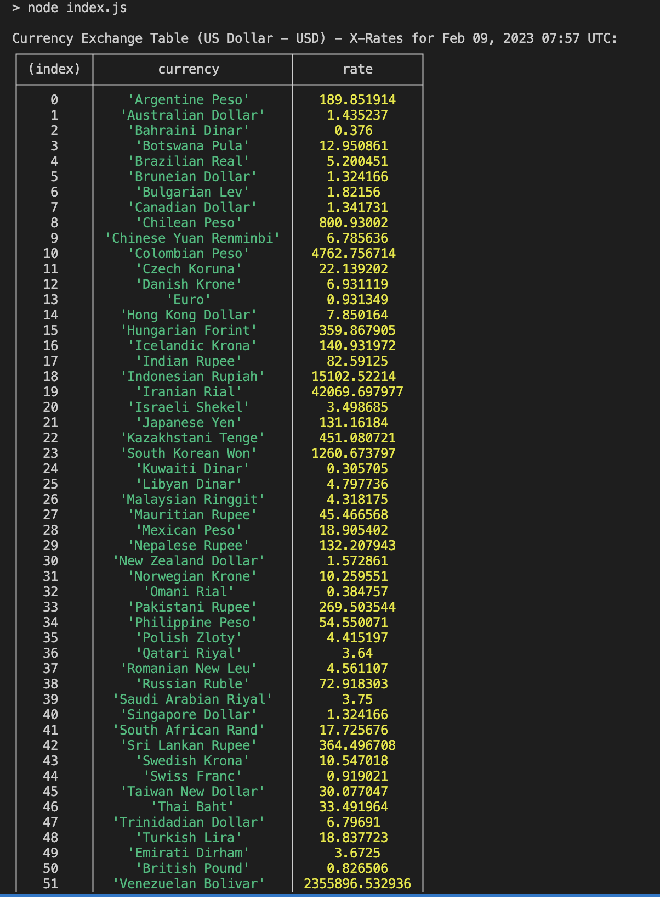

# Exchange Rates Scraper

## Description
An web scraper made in Javascript. It scrapes exchange rates from X-Rates.

## How to Use

After cloning the repo, go to your terminal and run
```
npm i
npm start
```

You should see an output similar to the following:


I